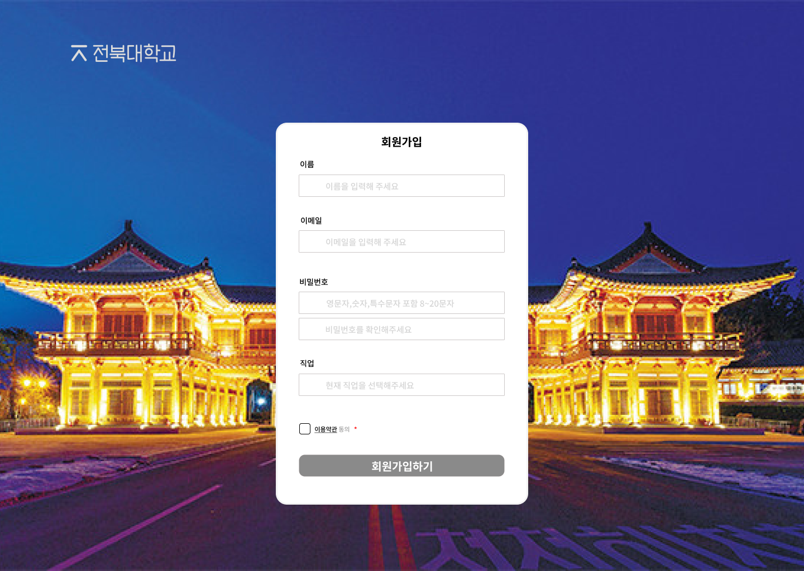

# 전북대학교 코딩테스트 학습관리 시스템

# 요구사항 정의

### 1. 사용자 관리
#### 회원가입 및 로그인 기능 (학생, 교수자, 관리자 역할 구분)
#### 사용자 프로필 관리
#### 비밀번호 재설정 및 보안 질문

### 2. 코드 에디터 및 온라인 저지 시스템
#### 웹 기반 코드 에디터 (다양한 프로그래밍 언어 지원: Python, Java, C++, JavaScript 등)
#### 코드 컴파일 및 실행 기능
#### 자동 채점 시스템 (테스트 케이스 기반)
#### 코드 제출 및 제출 기록 관리

### 3. LMS 기능
#### 강의 생성 및 관리
#### 강의 자료 업로드 및 공유 (문서, 동영상 등)
#### 과제 및 시험 관리
#### 학습 진도 추적
#### 토론 포럼 및 Q&A 섹션
### 4. 평가 및 성적 관리
#### 자동 채점 결과에 따른 성적 부여
#### 수동 채점 기능 (교수가 직접 코드 리뷰 및 점수 부여)
#### 성적 통계 및 분석
### 5. 커뮤니케이션 도구
#### 알림 기능 (과제 마감, 성적 발표 등)
### 6. 관리자 기능
#### 사용자 계정 관리 (승인, 차단 등)
#### 시스템 설정 관리
#### 데이터 백업 및 복구
### 7. 대회 기능
#### 대회 관리
- 대회 생성 및 관리 (대회 이름, 날짜, 시간, 설명 등)
- 대회 참가 신청 및 승인
- 대회 규칙 및 지침 설정
- 대회 문제 설정 및 관리
#### 대회 참가자 관리
- 참가자 등록 및 팀 구성 기능
- 참가자 목록 조회 및 관리
#### 문제 출제 및 관리
- 문제 출제 및 편집 기능
- 문제에 대한 테스트 케이스 설정
- 문제 공개 및 비공개 설정
- 문제 난이도 및 태그 설정
#### 실시간 대회 진행
-  시간 대회 진행 상황 모니터링
- 참가자의 문제 풀이 상황 및 제출 기록 조회
- 실시간 순위표 및 점수판 제공
- 실시간 채팅 및 Q&A 지원
#### 자동 채점 시스템
- 문제 제출 및 자동 채점 기능
- 다양한 프로그래밍 언어 지원
- 실시간 채점 결과 피드백 제공
- 테스트 케이스별 점수 배정
#### 결과 발표 및 시상
- 대회 종료 후 결과 발표 기능
- 참가자별 성적 통계 및 분석
#### 대회 기록 관리
- 대회별 기록 저장 및 조회
- 과거 대회 자료 보관 및 검색
- 대회 성적 및 분석 보고서 제공

# 와이어 프레임

